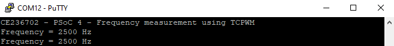

# PSOC&trade; 4: Frequency measurement using TCPWM

This code example demonstrates how to use the TCPWM peripheral in PSOC&trade; 4 devices to measure the frequency of a periodic digital signal.

[View this README on GitHub.](https://github.com/Infineon/mtb-example-psoc4-frequency-measurement-using-tcpwm)

[Provide feedback on this code example.](https://cypress.co1.qualtrics.com/jfe/form/SV_1NTns53sK2yiljn?Q_EED=eyJVbmlxdWUgRG9jIElkIjoiQ0UyMzY3MDIiLCJTcGVjIE51bWJlciI6IjAwMi0zNjcwMiIsIkRvYyBUaXRsZSI6IlBTT0MmdHJhZGU7IDQ6IEZyZXF1ZW5jeSBtZWFzdXJlbWVudCB1c2luZyBUQ1BXTSIsInJpZCI6InJhamFubmFnYXV0YSIsIkRvYyB2ZXJzaW9uIjoiMS40LjAiLCJEb2MgTGFuZ3VhZ2UiOiJFbmdsaXNoIiwiRG9jIERpdmlzaW9uIjoiTUNEIiwiRG9jIEJVIjoiSUNXIiwiRG9jIEZhbWlseSI6IlBTT0MifQ==)

## Requirements

- [ModusToolbox&trade;](https://www.infineon.com/modustoolbox) v3.5 or later (tested with v3.5)

- Board support package (BSP) minimum required version: 3.1.0
- Programming language: C
- Associated parts: [PSOC&trade; 4000S, PSOC&trade; 4100S Plus, PSOC&trade; 4500S, PSOC&trade; 4100S Max, PSOC&trade; 4100T Plus](https://www.infineon.com/cms/en/product/microcontroller/32-bit-psoc-arm-cortex-microcontroller/psoc-4-32-bit-arm-cortex-m0-mcu/) and [ PSOC&trade; 4 HV (High Voltage)](https://www.infineon.com/cms/en/product/microcontroller/32-bit-psoc-arm-cortex-microcontroller/32-bit-psoc-4-hv-arm-cortex-m0/)

## Supported toolchains (make variable 'TOOLCHAIN')

- GNU Arm&reg; Embedded Compiler v11.3.1 (`GCC_ARM`) – Default value of `TOOLCHAIN`
- Arm&reg; Compiler v6.22 (`ARM`)
- IAR C/C++ Compiler v9.50.2 (`IAR`)

## Supported kits (make variable 'TARGET')

- [PSOC&trade; 4100S Max Pioneer Kit](https://www.infineon.com/CY8CKIT-041S-MAX) (`CY8CKIT-041S-MAX`) - Default `TARGET`
- [PSOC&trade; 4100S Plus Prototyping Kit](https://www.infineon.com/CY8CKIT-149) (`CY8CKIT-149`)
- [PSOC&trade; 4000S CAPSENSE&trade; Prototyping Kit](https://www.infineon.com/CY8CKIT-145-40XX) (`CY8CKIT-145-40XX`)
- [PSOC&trade; 4500S Pioneer Kit](https://www.infineon.com/CY8CKIT-045S) (`CY8CKIT-045S`)
- [PSOC&trade; 4100T Plus CAPSENSE&trade; Prototyping kit](https://www.infineon.com/CY8CPROTO-041TP) (`CY8CPROTO-041TP`)
- [PSOC&trade; 4 HVMS-128K Evaluation Kit](https://www.infineon.com/cms/en/product/evaluation-boards/kit_psoc4-hvms-128k_lite/) (`KIT_PSOC4-HVMS-128K_LITE`)
- [PSOC&trade; 4 HVMS-64K Evaluation Kit](https://www.infineon.com/cms/en/product/evaluation-boards/kit_psoc4-hvms-64k_lite/) (`KIT_PSOC4-HVMS-64K_LITE`)

## Hardware setup

1. For [CY8CKIT-041S-MAX](https://www.infineon.com/CY8CKIT-041S-MAX), connect a jumper wire from PWM_FREQ_GEN (P2.4) output to COUNTER (P1.2) input.
2. For [CY8CKIT-145-40XX](https://www.infineon.com/CY8CKIT-145-40XX) and [CY8CKIT-149](https://www.infineon.com/CY8CKIT-149), connect a jumper wire from PWM_FREQ_GEN (P2.4) output to COUNTER (P0.0) input.
3. For [CY8CKIT-045S](https://www.infineon.com/CY8CKIT-045S), connect a jumper wire from PWM_FREQ_GEN (P3.0) output to COUNTER (P2.0) input.
4. For [CY8CPROTO-041TP](https://www.infineon.com/CY8CPROTO-041TP), connect a jumper wire from PWM_FREQ_GEN (P3.1) output to COUNTER (P2.1) input.
5. For [KIT_PSOC4-HVMS-128K_LITE](https://www.infineon.com/cms/en/product/evaluation-boards/kit_psoc4-hvms-128k_lite/) and [KIT_PSOC4-HVMS-64K_LITE](https://www.infineon.com/cms/en/product/evaluation-boards/kit_psoc4-hvms-64k_lite/), connect a jumper wire from PWM_FREQ_GEN (P3.1) output to COUNTER (P2.1) input.

> **Note:** Some of the PSOC&trade; 4 kits ship with KitProg2 installed. ModusToolbox&trade; requires KitProg3. Before using this code example, make sure that the board is upgraded to KitProg3. The tool and instructions are available in the [Firmware Loader](https://github.com/Infineon/Firmware-loader) GitHub repository. If you do not upgrade, you will see an error like "unable to find CMSIS-DAP device" or "KitProg firmware is out of date".

## Software setup

See the [ModusToolbox&trade; tools package installation guide](https://www.infineon.com/ModusToolboxInstallguide) for information about installing and configuring the tools package.

Install a terminal emulator if you don't have one. Instructions in this document use [Tera Term](https://teratermproject.github.io/index-en.html).

This example requires no additional software or tools.

## Using the code example

### Create the project

The ModusToolbox&trade; tools package provides the Project Creator as both a GUI tool and a command line tool.

<details><summary><b>Use Project Creator GUI</b></summary>

1. Open the Project Creator GUI tool.

   There are several ways to do this, including launching it from the dashboard or from inside the Eclipse IDE. For more details, see the [Project Creator user guide](https://www.infineon.com/ModusToolboxProjectCreator) (locally available at *{ModusToolbox&trade; install directory}/tools_{version}/project-creator/docs/project-creator.pdf*).

2. On the **Choose Board Support Package (BSP)** page, select a kit supported by this code example. See [Supported kits](#supported-kits-make-variable-target).
   > **Note:** To use this code example for a kit not listed here, you may need to update the source files. If the kit does not have the required resources, the application may not work.

3. On the **Select Application** page:

   a. Select the **Applications(s) Root Path** and the **Target IDE**.

   > **Note:** Depending on how you open the Project Creator tool, these fields may be pre-selected for you.

   b.	Select this code example from the list by enabling its check box.

   > **Note:** You can narrow the list of displayed examples by typing in the filter box.

   c. (Optional) Change the suggested **New Application Name** and **New BSP Name**.

   d. Click **Create** to complete the application creation process.

</details>

<details><summary><b>Use Project Creator CLI</b></summary>

The 'project-creator-cli' tool can be used to create applications from a CLI terminal or from within batch files or shell scripts. This tool is available in the *{ModusToolbox&trade; install directory}/tools_{version}/project-creator/* directory.

Use a CLI terminal to invoke the 'project-creator-cli' tool. On Windows, use the command-line 'modus-shell' program provided in the ModusToolbox&trade; installation instead of a standard Windows command-line application. This shell provides access to all ModusToolbox&trade; tools. You can access it by typing "modus-shell" in the search box in the Windows menu. In Linux and macOS, you can use any terminal application.


The following example clones the "[mtb-example-psoc4-frequency-measurement-using-tcpwm](https://github.com/Infineon/mtb-example-psoc4-frequency-measurement-using-tcpwm)" application with the desired name "FrequencyMeasurementTCPWM" configured for the [*CY8CKIT-041S-MAX*](https://www.infineon.com/CY8CKIT-041S-MAX) BSP into the specified working directory, *C:/mtb_projects*:

   ```
   project-creator-cli --board-id CY8CKIT-041S-MAX --app-id mtb-example-psoc4-frequency-measurement-using-tcpwm --user-app-name FrequencyMeasurementTCPWM --target-dir "C:/mtb_projects"
   ```
The 'project-creator-cli' tool has the following arguments:

Argument | Description | Required/optional
---------|-------------|-----------
`--board-id` | Defined in the <id> field of the [BSP](https://github.com/Infineon?q=bsp-manifest&type=&language=&sort=) manifest | Required
`--app-id`   | Defined in the <id> field of the [CE](https://github.com/Infineon?q=ce-manifest&type=&language=&sort=) manifest | Required
`--target-dir`| Specify the directory in which the application is to be created if you prefer not to use the default current working directory | Optional
`--user-app-name`| Specify the name of the application if you prefer to have a name other than the example's default name | Optional


> **Note:** The project-creator-cli tool uses the `git clone` and `make getlibs` commands to fetch the repository and import the required libraries. For details, see the "Project creator tools" section of the [ModusToolbox&trade; tools package user guide](https://www.infineon.com/ModusToolboxUserGuide) (locally available at {ModusToolbox&trade; install directory}/docs_{version}/mtb_user_guide.pdf).

</details>

### Open the project

After the project has been created, you can open it in your preferred development environment.

<details><summary><b>Eclipse IDE</b></summary>

If you opened the Project Creator tool from the included Eclipse IDE, the project will open in Eclipse automatically.

For more details, see the [Eclipse IDE for ModusToolbox&trade; user guide](https://www.infineon.com/MTBEclipseIDEUserGuide) (locally available at *{ModusToolbox&trade; install directory}/docs_{version}/mt_ide_user_guide.pdf*).

</details>

<details><summary><b>Visual Studio (VS) Code</b></summary>

Launch VS Code manually, and then open the generated *{project-name}.code-workspace* file located in the project directory.

For more details, see the [Visual Studio Code for ModusToolbox&trade; user guide](https://www.infineon.com/MTBVSCodeUserGuide) (locally available at *{ModusToolbox&trade; install directory}/docs_{version}/mt_vscode_user_guide.pdf*).

</details>

<details><summary><b>Keil µVision</b></summary>

Double-click the generated *{project-name}.cprj* file to launch the Keil µVision IDE.

For more details, see the [Keil µVision for ModusToolbox&trade; user guide](https://www.infineon.com/MTBuVisionUserGuide) (locally available at *{ModusToolbox&trade; install directory}/docs_{version}/mt_uvision_user_guide.pdf*).

</details>

<details><summary><b>IAR Embedded Workbench</b></summary>

Open IAR Embedded Workbench manually, and create a new project. Then select the generated *{project-name}.ipcf* file located in the project directory.

For more details, see the [IAR Embedded Workbench for ModusToolbox&trade; user guide](https://www.infineon.com/MTBIARUserGuide) (locally available at *{ModusToolbox&trade; install directory}/docs_{version}/mt_iar_user_guide.pdf*).

</details>

<details><summary><b>Command line</b></summary>

If you prefer to use the CLI, open the appropriate terminal, and navigate to the project directory. On Windows, use the command-line 'modus-shell' program; on Linux and macOS, you can use any terminal application. From there, you can run various `make` commands.

For more details, see the [ModusToolbox&trade; tools package user guide](https://www.infineon.com/ModusToolboxUserGuide) (locally available at *{ModusToolbox&trade; install directory}/docs_{version}/mtb_user_guide.pdf*).

</details>


## Operation

1. Connect the board to your PC using the provided USB cable through the KitProg3 USB connector.

2. Open a terminal program and select the KitProg3 COM port. Set the serial port parameter to 115200 baud.

3. Program the board using one of the following:

   <details><summary><b>Using Eclipse IDE for ModusToolbox&trade;</b></summary>

      1. Select the application project in the Project Explorer.

      2. In the **Quick Panel**, scroll down, and click **\<Application Name> Program (KitProg3_MiniProg4)**.

   </details>
   <details><summary><b>In other IDEs</b></summary>

   Follow the instructions in your preferred IDE.
   </details>

   <details><summary><b>Using CLI</b></summary>

     From the terminal, execute the `make program` command to build and program the application using the default toolchain to the default target. The default toolchain is specified in the application's Makefile but you can override this value manually:
      ```
      make program TOOLCHAIN=<toolchain>
      ```

      Example:
      ```
      make program TOOLCHAIN=GCC_ARM
      ```
   </details>

4.  After programming, the UART terminal displays the code example title and the frequency as shown in **Figure 1**.

    **Figure 1. "UART terminal displaying starting message and result**

    

5.  To test the code example, change the period and compare values of the PWM_FREQ_GEN peripheral to generate a different frequency.


## Debugging

You can debug the example to step through the code.

<details><summary><b>In Eclipse IDE</b></summary>

Use the **\<Application Name> Debug (KitProg3_MiniProg4)** configuration in the **Quick Panel**. For details, see the "Program and debug" section in the [Eclipse IDE for ModusToolbox&trade; user guide](https://www.infineon.com/MTBEclipseIDEUserGuide).

</details>

<details><summary><b>In other IDEs</b></summary>

Follow the instructions in your preferred IDE.
</details>

## Design and implementation

This example uses three TCPWM peripherals.

 - One is set up as a counter (ONE_SEC_TIMER) with a 1-kHz clock and a period of 999. The overflow output generates a pulse every second and connects directly to the capture input of the counter.

 - A second is set up as a PWM (PWM_FREQ_GEN) with a 1-MHz clock. Based on the “Period” and “Compare” values, it generates a signal at a particular frequency. By default, the peripheral is configured to generate a signal at 2500 Hz (2.5 kHz).

 - The third peripheral is set up as a counter (COUNTER) with a 1-MHz clock. It receives the capture input from the ONE_SEC_TIMER and the input signal from the frequency generator (PWM_FREQ_GEN). After each second, it reads the count from the frequency generator (PWM_FREQ_GEN). Firmware performs the calculation to identify the input frequency based on how the count changes each second.

A UART peripheral with a baud rate of 115200 bps is configured to display the result in a terminal application such as Tera Term or PuTTY.

### Resources and settings

**Table 1. Application resources**

 Resource  |  Alias/object     |    Purpose
 :------- | :------------    | :------------
 Timer Counter (TCPWM) | COUNTER| Count the number of rising edges of the input signal
 Timer Counter (TCPWM) | ONE_SEC_TIMER| Generates a one-second time window
 PWM (TCPWM) | PWM_FREQ_GEN| Generates a signal at a particular frequency based on the period and compares values
 Clock | CLOCK_TIMER | Drive the ONE_SEC_TIMER at 1-kHz
 Clock | CLOCK_FREQ_GEN | Drive the PWM_FREQ_GEN at 1-MHz
 Clock | CLOCK_COUNTER | Drive the COUNTER at 1-MHz
 Interrupt | sysint_counter | Configure the interrupt
 UART (SCB) | UART | Serial communication block for output on a terminal emulator

<br>

## Related resources

Resources  | Links
-----------|----------------------------------
Application notes  | [AN79953](https://www.infineon.com/AN79953) – Getting started with PSOC&trade; 4 <br>[AN0034](https://www.infineon.com/dgdl/?fileId=8ac78c8c93dda25b01954cc962534907) - Getting started with PSOC&trade; 4 HV MS MCUs in ModusToolbox&trade;
Code examples  | [Using ModusToolbox&trade;](https://github.com/Infineon/Code-Examples-for-ModusToolbox-Software) on GitHub
Device documentation | [PSOC&trade; 4 datasheets](https://www.infineon.com/cms/en/search.html#!view=downloads&term=psoc4&doc_group=Data%20Sheet) <br>[PSOC&trade; 4 technical reference manuals](https://www.infineon.com/cms/en/search.html#!view=downloads&term=psoc4&doc_group=Additional%20Technical%20Information) <br>[PSOC&trade; high voltage (HV) mixed signal (MS) automotive MCU 128K datasheets](https://www.infineon.com/dgdl/?fileId=8ac78c8c956a0a47019581095cec5cf6) <br>[PSOC&trade; high voltage (HV) mixed signal (MS) automotive MCU 64K datasheets](https://www.infineon.com/dgdl/?fileId=8ac78c8c956a0a470195817712a75d7a) <br>[PSOC&trade; high voltage (HV) mixed signal (MS) MCU: PSOC&trade; HVMS-128K registers reference manuals](https://www.infineon.com/dgdl/?fileId=8ac78c8c95650102019567b74fb62a38) <br>[PSOC&trade; high voltage (HV) mixed signal (MS) MCU: PSOC&trade; HVMS-64K registers reference manuals](https://www.infineon.com/dgdl/?fileId=8ac78c8c93dda25b019562232806264b&da=t) <br>[PSOC&trade; high voltage (HV) mixed signal (MS) MCU architecture reference manuals](https://www.infineon.com/dgdl/?fileId=8ac78c8c93dda25b0195297d34bf3ee6&da=t)
Development kits | Select your kits from the [Evaluation board finder](https://www.infineon.com/cms/en/design-support/finder-selection-tools/product-finder/evaluation-board) page.
Libraries on GitHub | [mtb-pdl-cat2](https://github.com/Infineon/mtb-pdl-cat2) – PSOC&trade; 4 Peripheral Driver Library (PDL) <br> [mtb-hal-cat2](https://github.com/Infineon/mtb-hal-cat2) – Hardware Abstraction Layer (HAL) library
Tools  | [ModusToolbox&trade;](https://www.infineon.com/modustoolbox) – ModusToolbox&trade; software is a collection of easy-to-use libraries and tools enabling rapid development with Infineon MCUs for applications ranging from wireless and cloud-connected systems, edge AI/ML, embedded sense and control, to wired USB connectivity using PSOC&trade; Industrial/IoT MCUs, AIROC&trade; Wi-Fi and Bluetooth&reg; connectivity devices, XMC&trade; Industrial MCUs, and EZ-USB&trade;/EZ-PD&trade; wired connectivity controllers. ModusToolbox&trade; incorporates a comprehensive set of BSPs, HAL, libraries, configuration tools, and provides support for industry-standard IDEs to fast-track your embedded application development.

<br>

## Other resources

Infineon provides a wealth of data at [www.infineon.com](https://www.infineon.com) to help you select the right device, and quickly and effectively integrate it into your design.

## Document history

Document title: *CE236702* - *PSOC&trade; 4: Frequency measurement using TCPWM*

 Version | Description of change
 ------- | ---------------------
 1.0.0   | New code example
 1.1.0   | Added support for CY8CKIT-045S and updated to support ModusToolbox&trade; v3.1.
 1.2.0   | Added support for KIT_PSOC4-HVMS-128K_LITE and KIT_PSOC4-HVMS-64K_LITE and updated to support ModusToolbox&trade; v3.2.
 1.3.0   | Added support for CY8CPROTO-041TP and updated to support ModusToolbox&trade; v3.5. <br> Changed HVMS kit name PSOC4 to PSOC4.
 1.4.0   | Added support for KIT_PSOC4-HVMS-128K_LITE-02 and KIT_PSOC4-HVMS-64K_LITE-02 
<br>

---------------------------------------------------------

© Cypress Semiconductor Corporation, 2023-2025. This document is the property of Cypress Semiconductor Corporation, an Infineon Technologies company, and its affiliates ("Cypress").  This document, including any software or firmware included or referenced in this document ("Software"), is owned by Cypress under the intellectual property laws and treaties of the United States and other countries worldwide.  Cypress reserves all rights under such laws and treaties and does not, except as specifically stated in this paragraph, grant any license under its patents, copyrights, trademarks, or other intellectual property rights.  If the Software is not accompanied by a license agreement and you do not otherwise have a written agreement with Cypress governing the use of the Software, then Cypress hereby grants you a personal, non-exclusive, nontransferable license (without the right to sublicense) (1) under its copyright rights in the Software (a) for Software provided in source code form, to modify and reproduce the Software solely for use with Cypress hardware products, only internally within your organization, and (b) to distribute the Software in binary code form externally to end users (either directly or indirectly through resellers and distributors), solely for use on Cypress hardware product units, and (2) under those claims of Cypress's patents that are infringed by the Software (as provided by Cypress, unmodified) to make, use, distribute, and import the Software solely for use with Cypress hardware products.  Any other use, reproduction, modification, translation, or compilation of the Software is prohibited.
<br>
TO THE EXTENT PERMITTED BY APPLICABLE LAW, CYPRESS MAKES NO WARRANTY OF ANY KIND, EXPRESS OR IMPLIED, WITH REGARD TO THIS DOCUMENT OR ANY SOFTWARE OR ACCOMPANYING HARDWARE, INCLUDING, BUT NOT LIMITED TO, THE IMPLIED WARRANTIES OF MERCHANTABILITY AND FITNESS FOR A PARTICULAR PURPOSE.  No computing device can be absolutely secure.  Therefore, despite security measures implemented in Cypress hardware or software products, Cypress shall have no liability arising out of any security breach, such as unauthorized access to or use of a Cypress product. CYPRESS DOES NOT REPRESENT, WARRANT, OR GUARANTEE THAT CYPRESS PRODUCTS, OR SYSTEMS CREATED USING CYPRESS PRODUCTS, WILL BE FREE FROM CORRUPTION, ATTACK, VIRUSES, INTERFERENCE, HACKING, DATA LOSS OR THEFT, OR OTHER SECURITY INTRUSION (collectively, "Security Breach").  Cypress disclaims any liability relating to any Security Breach, and you shall and hereby do release Cypress from any claim, damage, or other liability arising from any Security Breach.  In addition, the products described in these materials may contain design defects or errors known as errata which may cause the product to deviate from published specifications. To the extent permitted by applicable law, Cypress reserves the right to make changes to this document without further notice. Cypress does not assume any liability arising out of the application or use of any product or circuit described in this document. Any information provided in this document, including any sample design information or programming code, is provided only for reference purposes.  It is the responsibility of the user of this document to properly design, program, and test the functionality and safety of any application made of this information and any resulting product.  "High-Risk Device" means any device or system whose failure could cause personal injury, death, or property damage.  Examples of High-Risk Devices are weapons, nuclear installations, surgical implants, and other medical devices.  "Critical Component" means any component of a High-Risk Device whose failure to perform can be reasonably expected to cause, directly or indirectly, the failure of the High-Risk Device, or to affect its safety or effectiveness.  Cypress is not liable, in whole or in part, and you shall and hereby do release Cypress from any claim, damage, or other liability arising from any use of a Cypress product as a Critical Component in a High-Risk Device. You shall indemnify and hold Cypress, including its affiliates, and its directors, officers, employees, agents, distributors, and assigns harmless from and against all claims, costs, damages, and expenses, arising out of any claim, including claims for product liability, personal injury or death, or property damage arising from any use of a Cypress product as a Critical Component in a High-Risk Device. Cypress products are not intended or authorized for use as a Critical Component in any High-Risk Device except to the limited extent that (i) Cypress's published data sheet for the product explicitly states Cypress has qualified the product for use in a specific High-Risk Device, or (ii) Cypress has given you advance written authorization to use the product as a Critical Component in the specific High-Risk Device and you have signed a separate indemnification agreement.
<br>
Cypress, the Cypress logo, and combinations thereof, ModusToolbox, PSOC, CAPSENSE, EZ-USB, F-RAM, and TRAVEO are trademarks or registered trademarks of Cypress or a subsidiary of Cypress in the United States or in other countries. For a more complete list of Cypress trademarks, visit www.infineon.com. Other names and brands may be claimed as property of their respective owners.
